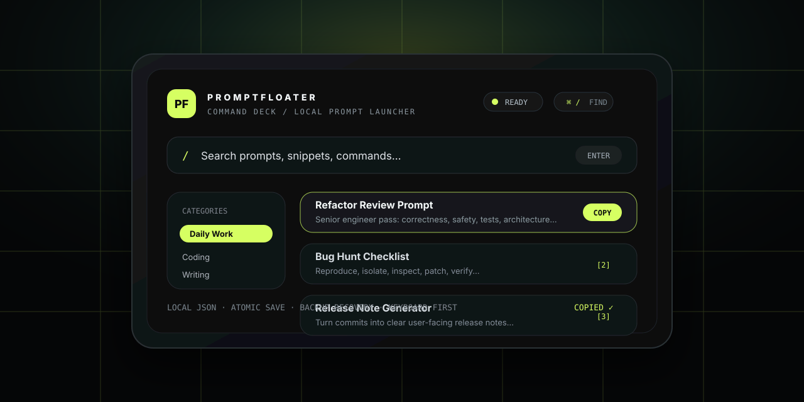

# PromptFloater



<p align="center">
  <a href="https://www.python.org/"></a>
  <a href="https://pywebview.flowrl.com/"></a>
  
  
</p>

<p align="center">
  <strong>桌面悬浮式 Prompt 指挥台，本地优先，键盘友好，一秒搜索/复制常用提示词。</strong><br>
  <strong>A local-first floating desktop prompt command deck for instant search and copy.</strong>
</p>

---

## 中文简介

PromptFloater 是一个桌面悬浮式 Prompt 管理工具。它把常用提示词、片段、命令和工作流放进一个轻量窗口里，让你可以通过鼠标、搜索框或键盘快捷键快速定位并复制。

它适合每天频繁使用 AI、写作、编程、复盘或整理工作流的人：不需要打开笔记软件，不需要翻历史记录，也不依赖云端服务。

## English Overview

PromptFloater is a floating desktop prompt manager. It keeps your frequently used prompts, snippets, commands, and workflows in a lightweight command deck so you can search, select, and copy them instantly.

It is designed for people who work with AI, writing, coding, reviews, or repeatable workflows every day: no note app hunting, no chat history digging, and no cloud dependency.

## 为什么做它 / Why it exists

写提示词最烦的不是“想不到”，而是每天重复找、复制、改同一批片段。PromptFloater 把这件事变成一个很快的小动作。

The hard part of prompt work is often not invention, but repeatedly finding, copying, and tweaking the same useful snippets. PromptFloater turns that into a fast desktop gesture.

- 常驻桌面边缘，需要时滑出。  
  Stays at the edge of your desktop and slides out when needed.
- 用 `/` 搜索，`↑`/`↓` 选择，`Enter` 复制。  
  Search with `/`, navigate with `↑`/`↓`, copy with `Enter`.
- 用分类、收藏和快捷键管理高频提示词。  
  Organize high-frequency prompts with categories, favorites, and shortcuts.
- 数据保存在本机，不依赖云端服务。  
  Stores data locally without relying on a cloud service.

## 亮点 / Highlights

| 能力 / Feature | 说明 / Description |
|---|---|
| Cyberpunk Command Deck | 青紫 HUD 风格桌面指挥台，带动态扫描、高密度列表和窄窗口自适应。<br>A cyan-magenta HUD command deck with animated scanning, dense lists, and responsive narrow-window layout. |
| 快速复制 / Fast copy | 点击、回车、数字键 `1`–`9` 都能复制当前条目。<br>Copy by clicking, pressing `Enter`, or using number keys `1`–`9`. |
| 搜索过滤 / Search | 按标题、内容、分类快速定位。<br>Filter quickly by title, content, or category. |
| 收藏与分类 / Favorites & categories | 支持收藏、分类管理、导入和导出 JSON。<br>Manage favorites, categories, JSON import, and JSON export. |
| Codex 用量 / Codex usage | 自动读取本地 Codex 用量快照，显示 5H/7D 用量和恢复时间。<br>Reads local Codex usage snapshots and shows 5H/7D usage plus reset time. |
| 透明动态缩边 / Transparent edge overlay | Windows 使用独立透明动态核心显示剩余用量，支持 DPI 定位、悬停展开和点击展开。<br>Windows uses a transparent animated usage core with DPI-aware positioning, hover-to-open, and click-to-open. |
| 本地优先 / Local-first | 用户数据写入系统应用数据目录，并保留 `.bak` 备份。<br>User data is stored in the system app-data directory with `.bak` backup. |
| 稳健存储 / Reliable storage | JSON Schema 校验、原子写入、损坏恢复、滚动日志。<br>Schema validation, atomic writes, corruption recovery, and rotating logs. |

## 快速开始 / Quick Start

### 普通用户 / Regular users

如果已经下载发布包，解压 `PromptFloater-Windows.zip` 后双击 `PromptFloater.exe` 即可。  
If you downloaded a release package, unzip `PromptFloater-Windows.zip` and double-click `PromptFloater.exe`.

### 1. 安装 Python / Install Python

需要 Python 3.8 或更高版本。  
Requires Python 3.8 or later.

- Windows：从 [python.org/downloads](https://www.python.org/downloads/) 安装，勾选 `Add Python to PATH`  
  Windows: install from [python.org/downloads](https://www.python.org/downloads/) and enable `Add Python to PATH`.
- macOS：`brew install python3` 或从 python.org 安装  
  macOS: run `brew install python3` or install from python.org.

### 2. 启动 / Launch

启动脚本会自动创建项目内 `.venv` 并安装依赖，不会污染系统 Python。  
The launcher scripts create a project-local `.venv` and install dependencies without touching your system Python.

| 平台 / Platform | 启动方式 / How to launch |
|---|---|
| Windows | 双击 `启动无黑窗.vbs`；需要看安装/报错时再双击 `启动.bat`<br>Double-click `启动无黑窗.vbs`; use `启动.bat` when you want to see setup or error output |
| macOS | 双击 `启动.command`（首次可能需要右键 → 打开）<br>Double-click `启动.command` (first launch may require right-click → Open) |
| 命令行 / CLI | Windows: `.venv\Scripts\python.exe app.py` |
| 命令行 / CLI | macOS/Linux: `.venv/bin/python3 app.py` |

## 快捷键 / Keyboard Shortcuts

| 按键 / Key | 操作 / Action |
|---|---|
| `/` | 聚焦搜索 / Focus search |
| `↑` / `↓` | 移动当前选择 / Move selection |
| `Enter` | 复制当前选择 / Copy selected prompt |
| `1`–`9` | 复制当前列表对应条目 / Copy the matching visible item |
| `N` | 新建提示词 / Create a new prompt |
| `E` | 编辑当前选择 / Edit selected prompt |
| `F` | 收藏/取消收藏当前选择 / Toggle favorite |
| `Esc` | 关闭弹窗、清空搜索或退出输入状态 / Close modal, clear search, or exit input state |

鼠标与键盘共享同一个选中项。复制成功时，对应条目会短暂显示 `COPIED ✓`。  
Mouse and keyboard share the same selected item. After copying, the item briefly shows `COPIED ✓`.

## Codex 用量 / Codex Usage

底部状态栏会显示最近一次本地 Codex 用量快照，例如 `CDX 5H剩79%`；完整的 5H/7D 剩余用量和恢复时间可在悬停提示中查看。Windows 缩边核心也会显示 5H 剩余百分比，鼠标悬停约 220ms 或点击即可展开。点击状态卡或工具菜单里的 `CODEX USAGE` 可手动刷新。<br>
The bottom status bar shows the latest local Codex usage snapshot, for example `CDX 5H剩79%`; full 5H/7D remaining usage and reset times are available in the tooltip. The Windows edge overlay also shows the remaining 5H percentage and opens after a roughly 220 ms hover or a click. Click the status chip or `CODEX USAGE` in the tools menu to refresh.

PromptFloater 只读取本机 `.codex/sessions` 和 `.codex/archived_sessions` 里的非敏感用量事件，不读取认证文件，也不会上传这些数据。  
PromptFloater only reads non-sensitive usage events from local `.codex/sessions` and `.codex/archived_sessions` logs. It does not read auth files and does not upload this data.

## 项目结构 / Project Structure

```text
PromptFloater
├─ app.py                    # pywebview desktop entry
├─ demo.html                 # desktop window markup and styles
├─ renderer/app.js           # frontend interactions, search, shortcuts, copy feedback
├─ promptfloater/
│  ├─ api.py                 # backend bridge API
│  ├─ codex_usage.py         # local Codex usage snapshot reader
│  ├─ paths.py               # cross-platform user-data paths
│  ├─ schema.py              # prompt data validation
│  ├─ storage.py             # atomic writes, backup, recovery
│  └─ logging_setup.py       # rotating logs
├─ data/prompts.json         # bundled default prompt data for first launch
├─ tests/                    # unit tests and UI contract tests
└─ docs/assets/              # GitHub repository visual assets
```

## 数据与日志 / Data & Logs

`data/prompts.json` 只作为首次运行的默认数据。真实用户数据会放到系统应用数据目录。  
`data/prompts.json` is only the bundled default for first launch. Real user data is stored in the system app-data directory.

| 系统 / OS | 用户数据目录 / User data directory |
|---|---|
| Windows | `%APPDATA%\PromptFloater` |
| macOS | `~/Library/Application Support/PromptFloater` |
| Linux | `${XDG_DATA_HOME:-~/.local/share}/PromptFloater` |

主要文件 / Main files:

- `prompts.json`：当前提示词库 / current prompt library
- `prompts.json.bak`：上一版备份 / previous backup
- `logs/promptfloater.log`：滚动日志，默认保留 3 份 / rotating log, keeping 3 files by default

## 开发与验证 / Development & Verification

```bash
python -m unittest discover -s tests -v
```

Windows 打包 / Windows packaging:

```bat
打包-Windows.bat
```

打包完成后会生成 / Outputs:

- `dist\PromptFloater\PromptFloater.exe`
- `release\PromptFloater-Windows.zip`

当前测试覆盖 / Current test coverage:

- 数据 Schema 校验 / data schema validation
- 原子存储与备份恢复 / atomic storage and backup recovery
- Python API 返回结构 / Python API response structure
- 前端安全 DOM 渲染 / safe frontend DOM rendering
- Command Deck 视觉与快捷键契约 / Command Deck visual and keyboard contracts
- Windows/macOS 启动脚本行为 / Windows and macOS launcher behavior

## 依赖 / Dependencies

| 包 / Package | 用途 / Purpose |
|---|---|
| `pywebview` | 桌面悬浮窗；Windows 使用 Edge WebView2，macOS 使用 WKWebView。<br>Desktop floating window; Edge WebView2 on Windows and WKWebView on macOS. |
| `pyperclip` | 跨平台剪贴板。<br>Cross-platform clipboard support. |

## Roadmap / 路线图

- [ ] 打包 Windows `.exe` 和 macOS `.app` / Package Windows `.exe` and macOS `.app`
- [ ] 增加真实截图/GIF 演示 / Add real screenshots or GIF demos
- [ ] 支持提示词变量模板 / Support prompt variable templates
- [ ] 支持全局热键唤起 / Support global hotkey activation
- [ ] 增加主题色配置 / Add configurable accent themes

## License / 许可证

暂未添加开源许可证。公开发布前建议补充 `LICENSE`，例如 MIT。  
No open-source license has been added yet. Add a `LICENSE`, such as MIT, before public distribution.
